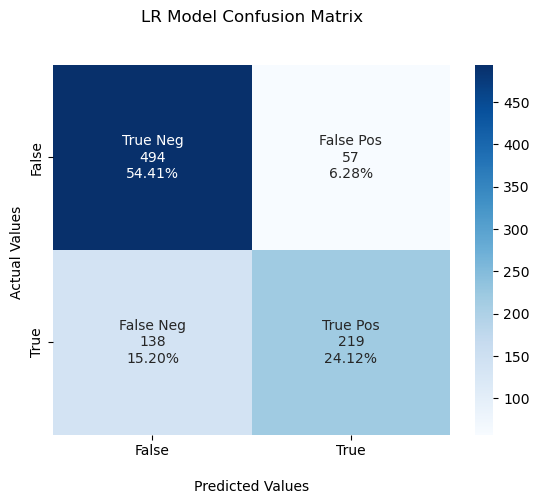
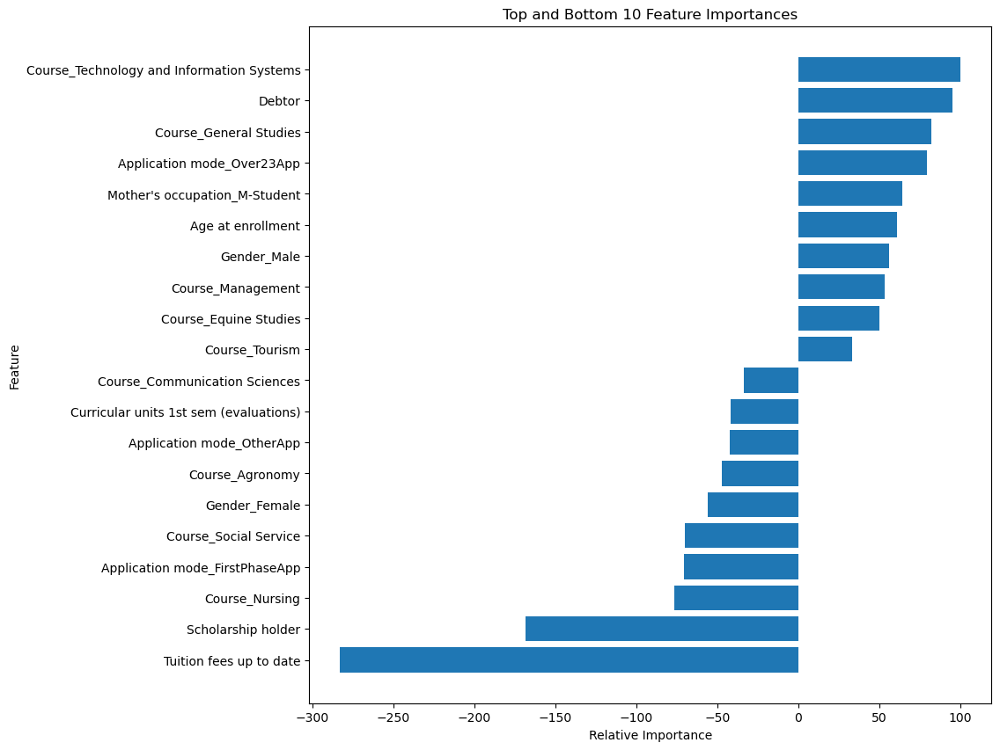
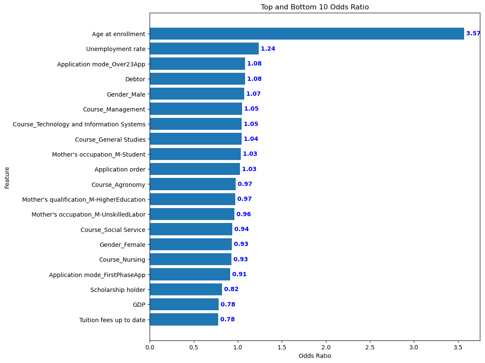

# Student Dropout Prediction

## Logistic Regression Reveals Factors that Increase or Decrease Outcomes.

**Overview**  
The goal of this project was to take a look at potential methods for determining student graduation or dropout. The data source highlights a year snapshot of students enrolled at the Polytechnic Institute of Portalegre, Portugal (see below for details). There are other methods than those proposed in the current state of this notebook, and at current, the output is early phase. 
 
 

**General Method**  
The data has three categories: Enrolled, Drop out, Graduate. The data was filtered to compare Drop out to Graduate, and the outcome of the Enrolled group was predicted with the outcome of the model. I opted for a simple Logist Regression model to start to emphasize the explainabilty present in Odds Ratios (see below for the outputs.). Some work was required to emphasize the explainability by putting Odds Ratios in the independent variable's original scale.

 
 

**To do:**  
Test other models and validate, and the initial insights need validation. Some feature engineering could be done to manipulate curricular approvals and enrollments in the given dataset, though, this is likely a characteristic of this dataset. The goal is to catch a student likely of dropping out before they've already failed to enroll in 2nd semester courses, so heading down the road of non curricular activity for this is likely more fruitful.
 
 

**Current Model Results** 
 
 

- An OR greater than 1 indicates that the predictor variable increases the odds of the outcome. The higher the OR, the stronger the association. For example, an OR of 3 means that individuals with the specific level of the predictor are 3 times more likely to experience the outcome compared to those without it.​

- An OR less than 1 indicates that the predictor variable decreases the odds of the outcome. The closer the OR is to 0, the stronger the protective effect. For example, an OR of 0.5 means that individuals with the specific level of the predictor are half as likely to experience the outcome compared to those without it.​

- An OR of 1 indicates no association between the predictor variable and the outcome.​

#### 1. Source Data

This dataset provides a comprehensive view of students enrolled in various undergraduate degrees offered at a higher education institution. It includes demographic data, social-economic factors and academic performance information that can be used to analyze the possible predictors of student dropout and academic success. This dataset contains multiple disjoint databases consisting of relevant information available at the time of enrollment, such as application mode, marital status, course chosen and more. Additionally, this data can be used to estimate overall student performance at the end of each semester by assessing curricular units credited/enrolled/evaluated/approved as well as their respective grades. Finally, we have unemployment rate, inflation rate and GDP from the region which can help us further understand how economic factors play into student dropout rates or academic success outcomes. This powerful analysis tool will provide valuable insight into what motivates students to stay in school or abandon their studies for a wide range of disciplines such as agronomy, design, education nursing journalism management social service or technologies.
 
 
Link Here: [Student-Dataset](https://www.kaggle.com/datasets/thedevastator/higher-education-predictors-of-student-retention/data)
Research Source: [Journal-Article](https://www.mdpi.com/2306-5729/7/11/146)

#### 2. Data Definitions

| Column name |	Description | Data Type |
|:------------|:------------|:----------|
| Marital status | The marital status of the student. | Categorical |
| Application mode | The method of application used by the student. | Categorical |
| Application order | The order in which the student applied | Numerical |
| Course |The course taken by the student. | Categorical |
| Daytime/evening attendance | Whether the student attends classes during the day or in the evening. | Categorical |
| Previous qualification | The qualification obtained by the student before enrolling in higher education. | Categorical |
| Nationality | The nationality of the student. | Categorical |
| Mother's qualification | The qualification of the student's mother. | Categorical |
| Father's qualification | The qualification of the student's father. | Categorical |
| Mother's occupation | The occupation of the student's mother. | Categorical |
| Father's occupation | The occupation of the student's father. | Categorical |
| Displaced	| Whether the student is a displaced person. | Categorical |
| Educational special needs | Whether the student has any special educational needs. | Categorical |
| Debtor | Whether the student is a debtor. | Categorical |
| Tuition fees up to date | Whether the student's tuition fees are up to date. | Categorical |
| Gender | The gender of the student. | Categorical |
| Scholarship holder | Whether the student is a scholarship holder. | Categorical |
| Age at enrollment | The age of the student at the time of enrollment. | Numerical |
| International	| Whether the student is an international student. | Categorical |
| Curricular units 1st sem (credited) | The number of curricular units credited by the student in the first semester. | Numerical |
| Curricular units 1st sem (enrolled) | The number of curricular units enrolled by the student in the first semester. | Numerical |
| Curricular units 1st sem (evaluations) | The number of curricular units evaluated by the student in the first semester. | Numerical |
| Curricular units 1st sem (approved) | The number of curricular units approved by the student in the first semester. | Numerical |